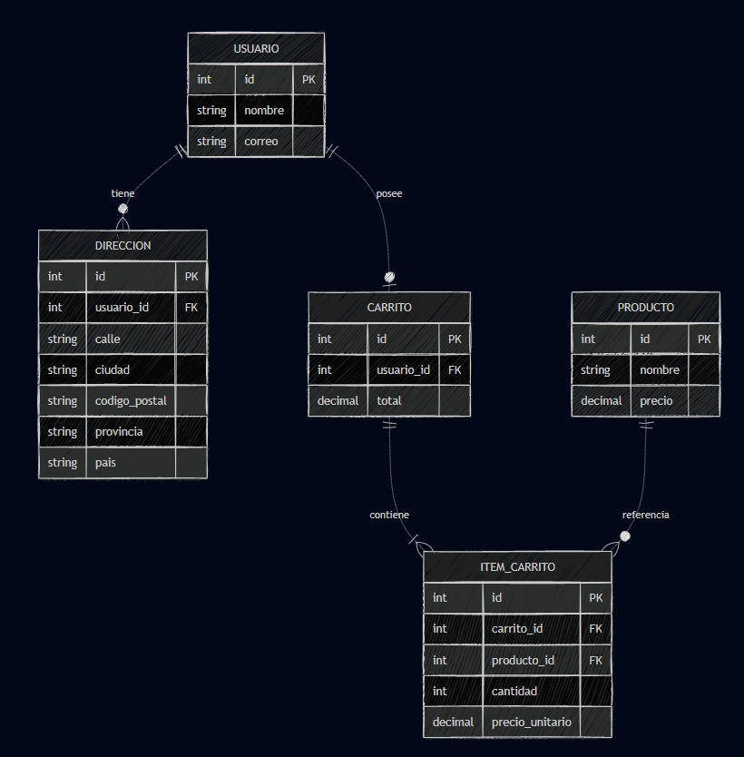

# ZeroUno — Tienda de Informática

  

## Integrantes

| Integrante              | DNI        |
|-------------------------|------------|
| **Javier Rey Sánchez**  | 80104407F  |
| **Laura Reinosa Sánchez** | 09093360B |

<table>
  <tr>
    <td align="center">
       
      <b>Javier Rey Sánchez</b>
    </td>
    <td align="center">
       
      <b>Laura Reinosa Sánchez</b>
    </td>
  </tr>
</table>

# Eslogan

*"La tecnología que simplifica tu vida"*

# Resumen

La aplicación web "ZeroUno" es una tienda de informática permite al
usuario explorar, filtrar y comprar productos tecnológicos de manera
sencilla e intuitiva. Se busca acercar la tecnología al día a día de las
personas mediante gadgets útiles, innovadores y accesibles.

# Descripción

ZeroUno es una aplicación web responsiva orientada en la venta de
productos tecnológicos (como ordenadores, periféricos, componentes y
accesorios) mediante una interfaz intuitiva y accesible desde cualquier
dispositivo.

El objetivo principal del proyecto es facilitar la experiencia de compra
online para los usuarios, con funcionalidades que permitan explorar,
comparar y adquirir productos de manera rápida y segura.

La aplicación está pensada para integrarse en un entorno Spring Boot con
base de datos relacional (en este caso se usará H2).

# Funcionalidades Principales

**1. Página de Inicio**

-   Presenta el eslogan y una galería de imágenes destacadas con
    productos.

-   Incluye un botón de acceso directo a "Explorar productos".

-   Diseño adaptativo para móviles y ordenadores.

**2. Catálogo de Productos**

-   Listado dinámico de productos obtenidos desde la base de datos.

-   Filtros y búsqueda por categoría, marca, precio o disponibilidad.

-   Posibilidad de ordenar los productos.

-   Visualización detallada de cada producto.

**3. Carrito de Compras**

-   Añadir productos desde el catálogo.

-   Modificar cantidad o eliminar artículos.

-   Cálculo automático del total con impuestos.

-   Simulación del proceso de compra con validación de datos.

-   Confirmación visual del pedido.

**4. Sección "Nosotros"**

-   Presenta los valores y objetivos de la tienda.

-   Información del equipo y visión empresarial.

-   Imagen corporativa coherente con el estilo de la web.

**5. Sección "Contacto"**

-   Formulario con campos: nombre, correo y mensaje.

-   Validación de datos (email correcto, campos obligatorios).

-   Enlaces a redes sociales y mapa de ubicación.

# Requisitos del sistema 

**Requisitos funcionales**

-   Permitir al usuario registrarse, navegar, filtrar y seleccionar
    productos.

-   Gestionar la información de productos (nombre, precio, descripción,
    stock).

-   Procesar operaciones de carrito (añadir, eliminar, modificar).

-   Enviar formularios de contacto con validación.

-   Mostrar páginas de información estática ("Nosotros", "Contacto").

**Requisitos no funcionales**

-   Usabilidad: interfaz simple y coherente, fácil de usar.

-   Compatibilidad: accesible desde diferentes navegadores.

-   Rendimiento: carga rápida de páginas y consultas optimizadas.

-   Seguridad: validación de datos y prevención de errores en el
    servidor.

-   Escalabilidad: preparada para integrar nuevas funcionalidades.

**Requisitos técnicos**

-   Backend: Java con Spring Boot.

-   Base de datos: H2

-   Servidor: Tomcat embebido.

-   Control de versiones: Git / GitHub.

# Funcionalidades opcionales, recomendables o futuribles

• Diferentes formas de pago (PayPal, Bizum, etc.) para completar compras
reales.

• Sistema de registro e inicio de sesión con historial de pedidos,
direcciones y métodos de pago guardados.

• Panel de administración para gestionar productos, categorías y pedidos
desde el navegador.

• Valoraciones y reseñas por parte de los clientes en cada producto.

• Chat en tiempo real para atención al cliente.

• Sección de ofertas y promociones, actualizadas automáticamente.

• Modo oscuro y opción multilenguaje (español/inglés).

• Integración con APIs externas.

 # Especificaciones de Caso de Uso 

## 1. Modelo conceptual
Entidades :
- **USUARIO**(id, nombre, correo)
- **CARRITO**(id, usuario_id, total)
- **PRODUCTO**(id, nombre, precio)
- **ITEM_CARRITO**(id, carrito_id, producto_id, cantidad, precio_unitario)

Relaciones y cardinalidades:
- **USUARIO 1 — N CARRITO** (un usuario puede poseer varios carritos).
- **CARRITO 1 — N ITEM_CARRITO** (un carrito contiene varios ítems).
- **PRODUCTO 1 — N ITEM_CARRITO** (un producto puede estar referenciado por muchos ítems de carrito).

Claves ajenas:
- `CARRITO.usuario_id → USUARIO.id`
- `ITEM_CARRITO.carrito_id → CARRITO.id`
- `ITEM_CARRITO.producto_id → PRODUCTO.id`

>`ITEM_CARRITO.precio_unitario` captura el precio del producto en el momento de añadirlo al carrito, guardando el valor aunque cambie `PRODUCTO.precio`.

---

## 2. Casos de Uso

### CU.01 — Registrarse
**Actor principal:** Usuario  
**Objetivo:** Crear una cuenta para acceder a funcionalidades personalizadas.  
**Precondiciones:** El correo no debe estar registrado.  
**Flujo principal:**
1. El usuario abre el formulario de registro.
2. Proporciona nombre, correo y contraseña.
3. El sistema valida los datos y crea el registro en **USUARIO**.
4. Se confirma el alta y se habilita el inicio de sesión.  
**Postcondiciones:** Existe un usuario válido y autenticable.

---

### CU.02 — Iniciar sesión
**Actor principal:** Usuario  
**Objetivo:** Acceder a su sesión autenticada.  
**Flujo principal:**
1. Introduce correo y contraseña.
2. El sistema verifica credenciales.
3. Se inicia sesión y se redirige al inicio.  
**Postcondiciones:** Sesión válida asociada a usuario.

---

### CU.03 — Explorar y filtrar productos
**Actor principal:** Usuario  
**Objetivo:** Visualizar el catálogo y aplicar filtros.  
**Flujo principal:**
1. El usuario entra a producto.
2. Aplica filtros (categoría, marca, precio) si están disponibles en la interfaz.
3. El sistema muestra la lista resultante.  
**Postcondiciones:** Catálogo presentado conforme a los criterios.

---

### CU-04 — Añadir producto al carrito
**Actor principal:** Usuario  
**Objetivo:** Incluir un producto o varios en el carrito.  
**Precondiciones:** Debe existir un carrito activo para el usuario (se crea si no existe).  
**Flujo principal:**
1. El usuario selecciona un producto.
2. El sistema verifica disponibilidad y obtiene el `precio` vigente.
3. Se crea/actualiza item_carritos con `cantidad` y `precio_unitario`.
4. Se recalcula `CARRITO.total`.  
**Postcondiciones:** Ítem persistido en item_carrito y total del carrito actualizado.

**Flujos alternativos:**
- 1: Si el ítem ya existe en el carrito, se incrementa `cantidad` en lugar de crear un nuevo registro.
- 2: Si no hay stock se notifica y se impide la acción.

---

### CU-05 — Eliminar ítem del carrito
**Actor principal:** Usuario  
**Objetivo:** Retirar un producto del carrito.  
**Flujo principal:**
1. El usuario solicita eliminar un item_carrito concreto.
2. El sistema borra el ítem y recalcula `CARRITO.total`.  
**Postcondiciones:** Ítem inexistente y total coherente.

---

### CU-06 — Procesar compra 
**Actor principal:** Usuario / Sistema de pago  
**Objetivo:** Pagar el carrito y generar el pedido.
**Precondiciones:** Carrito contiene al menos un item_carrito.  
**Flujo principal:**
1. El usuario confirma el resumen del carrito.
2. El sistema de pagos procesa la transacción.
3. Se marca el carrito como “finalizado”.
4. Se registra el comprobante y se mantiene el `precio_unitario`.  
**Postcondiciones:** Compra registrada; el carrito deja de estar activo.

---

### CU-07 — Gestión de catálogo
**Actor principal:** Administrador  
**Objetivo:** Alta, baja y modificación de producto.  
**Flujo principal:**
1. El administrador accede al panel de productos.
2. Crea, edita o desactiva un producto.
3. Los cambios quedan disponibles para el usuario final.  
**Postcondiciones:** Catálogo actualizado.

---

## 3. Como gestionar casos de uso

### 3.1. `USUARIO` → `CARRITO` (`CARRITO.usuario_id`)
**Cardinalidad:** 1 — N  
**Recomendación de borrado: `ON DELETE CASCADE`**
- **Qué ocurre si se borra un USUARIO:**  
  Se eliminan automáticamente sus **CARRITO(s)** y, por cascada, todos los **ITEM_CARRITO** asociados.
- **Justificación:** Esta relación refleja la dependencia funcional entre el usuario y sus carritos. El carrito solo tiene sentido cuando pertenece a un usuario, ya que representa una compra en proceso asociada a su cuenta. Al eliminar al usuario, deben eliminarse también todos los carritos y los ítems asociados, evitando datos huérfanos o inconsistentes.

---

### 3.2. `CARRITO` → `ITEM_CARRITO` (`ITEM_CARRITO.carrito_id`)
**Cardinalidad:** 1 — N  
**Recomendación de borrado: `ON DELETE CASCADE`**
- **Qué ocurre si se borra un CARRITO:**  
  Se deben eliminar todos los **ITEM_CARRITO** contenidos.  
- **Justificación:** La existencia de `ITEM_CARRITO` depende completamente del carrito (entidad débil). Si se borra un carrito, se borran también los productos que tenía para que no queden datos colgados.

---

### 3.3. `PRODUCTO` → `ITEM_CARRITO` (FK: `ITEM_CARRITO.producto_id`)
**Cardinalidad:** 1 — N  
**Recomendación de borrado:**  
En este caso, no es buena idea borrar un producto directamente si todavía está en algún carrito.  
Si se hiciera, se perdería la información de esas compras o carritos.  
Lo ideal es restringir el borrado (`ON DELETE RESTRICT`) y, en lugar de eliminar el producto, marcarlo como “inactivo” o “no disponible”.  
Así deja de mostrarse en el catálogo, pero los datos de los carritos y compras anteriores se conservan.

**Justificación:**  
A diferencia de los carritos o ítems, los productos tienen un valor histórico.  
Incluso si ya no se venden, siguen apareciendo en los registros de compras.  
Por eso no conviene borrarlos físicamente: se pierde trazabilidad (es decir, la posibilidad de saber qué compró el usuario y a qué precio).  
Marcar el producto como inactivo es una forma más segura y profesional de mantener la información sin afectar al funcionamiento del sistema.

---

### 3.4. Resumen de políticas recomendadas
- `CARRITO.usuario_id → USUARIO.id` **ON DELETE CASCADE**
- `ITEM_CARRITO.carrito_id → CARRITO.id` **ON DELETE CASCADE**
- `ITEM_CARRITO.producto_id → PRODUCTO.id` **ON DELETE RESTRICT**  

---
### 3.5. Reglas adicionales de integridad

- **Cálculo del total del carrito:**  
  El total del carrito tiene que ser siempre la suma de todos los productos que contiene.  
  Es decir: `total = cantidad × precio` de cada ítem.  
  Este valor debe actualizarse cada vez que se añada, elimine o cambie un producto.

- **Cantidad mínima:**  
  No se pueden añadir productos con cantidad 0 o negativa.  
  Como mínimo, cada ítem del carrito debe tener una cantidad de **1**.

- **Precio correcto:**  
  Los precios no pueden ser negativos.  
  Además, una vez que se guarda un precio en el carrito, no debería cambiarse, para mantener el historial real de la compra.

- **Un solo registro por producto:**  
  En un mismo carrito no debería haber dos líneas para el mismo producto.  
  Si el usuario añade el mismo artículo varias veces, lo ideal es sumar las cantidades en lugar de crear un nuevo registro.

- **Usuarios activos:**  
  No se deberían mantener carritos activos de usuarios que estén deshabilitados o eliminados.  
  Esto evita errores y mantiene la coherencia de los datos.

- **Control del stock:**  
  Si el sistema maneja stock, hay que comprobarlo cuando se añade un producto o cuando se va a pagar.  
  Así se evita vender productos que ya no están disponibles.  
  En algunos casos puede reservarse el stock al añadir al carrito, pero lo más común es hacerlo al finalizar la compra.

**En resumen:**  
Estas reglas ayudan a que los datos del sistema sean coherentes y que los cálculos siempre reflejen la realidad.  
De esta forma se evitan errores en precios, cantidades o productos duplicados, y el sistema funciona de manera más ordenada y fiable.

---

**DIAGRAMA ENTIDAD -- RELACIÓN**

## Descripcion diagrama

USUARIO:

-Contiene la información básica de cada usuario.

-Campos:

        id: identificador único (clave primaria).
        nombre: nombre del usuario.
        correo: dirección de correo electrónico.

-Relaciones:

        Un usuario tiene una dirección (relación uno a uno con DIRECCION).
        Un usuario posee un carrito (relación uno a uno con CARRITO).

DIRECCION:

-Almacena la información de dirección asociada a un usuario.

-Campos:

        id: identificador único (clave primaria).
        usuario_id: clave foránea que referencia a USUARIO.
        calle, ciudad, codigo_postal, provincia, pais: datos de la dirección.

-Relación:

        Cada dirección pertenece a un usuario.
        
-Cardinalidad: un usuario tiene una dirección, una dirección pertenece a un usuario.

CARRITO:

-Representa el carrito de compras de un usuario.

-Campos:

        id: identificador único (clave primaria).
        usuario_id: clave foránea que referencia a USUARIO.
        total: valor total del carrito.

-Relación:

        Cada usuario tiene un carrito.
        
-Cardinalidad: un usuario tiene un carrito, un carrito pertenece a un usuario.

ITEM_CARRITO:

-Es una tabla intermedia que relaciona los carritos con los productos y guarda la cantidad y el precio de cada producto dentro de un carrito.

-Campos:

        id: identificador único (clave primaria).
        carrito_id: clave foránea que referencia a CARRITO.
        producto_id: clave foránea que referencia a PRODUCTO.
        cantidad: número de unidades del producto.
        precio_unitario: precio por unidad del producto.

-Relaciones:

        Un carrito contiene varios ítems.
        Cada ítem está asociado a un producto.

-Cardinalidad: un carrito puede tener muchos ítems, y un producto puede estar en muchos carritos a través de los ítems.

PRODUCTO:

-Contiene los datos de los productos disponibles.

-Campos:

        id: identificador único (clave primaria).
        nombre: nombre del producto.
        precio: precio del producto.

-Relaciones:

        Un producto puede aparecer en varios ítems de carrito.

-Cardinalidad: un producto puede estar en muchos ítems de carrito.